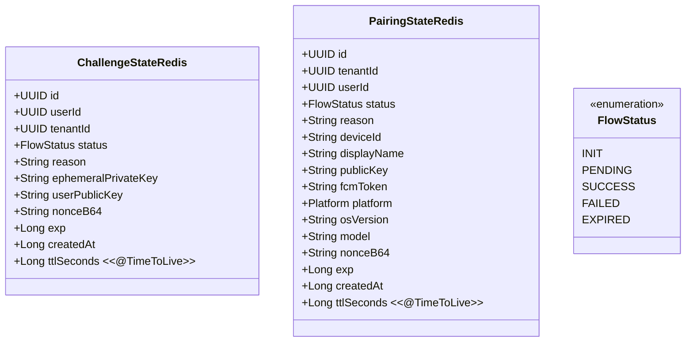

# Cache Objects

```mermaid
classDiagram
    class ChallengeStateRedis {
        +UUID id
        +UUID userId
        +UUID tenantId
        +FlowStatus status
        +String reason
        +String ephemeralPrivateKey
        +String userPublicKey
        +String nonceB64
        +Long exp
        +Long createdAt
        +Long ttlSeconds <<@TimeToLive>>
    }

    class PairingStateRedis {
        +UUID id
        +UUID tenantId
        +UUID userId
        +FlowStatus status
        +String reason
        +String deviceId
        +String displayName
        +String publicKey
        +String fcmToken
        +Platform platform
        +String osVersion
        +String model
        +String nonceB64
        +Long exp
        +Long createdAt
        +Long ttlSeconds <<@TimeToLive>>
    }

    class FlowStatus {
      <<enumeration>>
      INIT
      PENDING
      SUCCESS
      FAILED
      EXPIRED
    }


```
