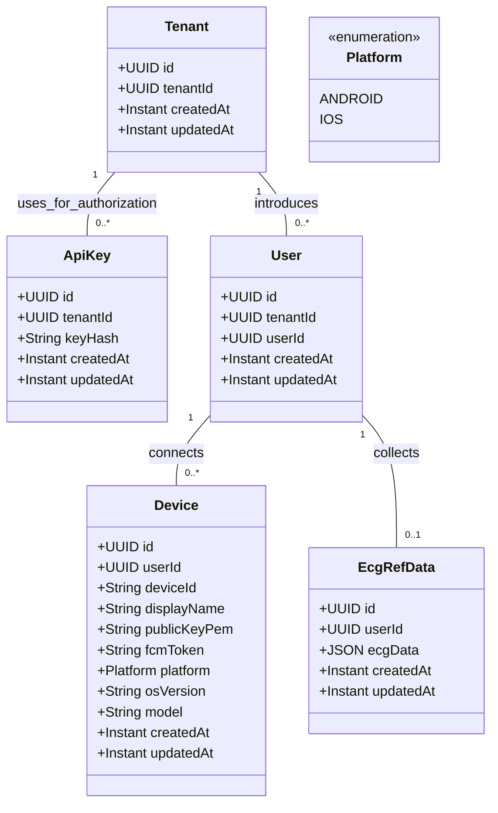

# Main Database Schema

```mermaid
classDiagram
    %% === Domain (SQL-backed) ===
    class Tenant {
      +UUID id
      +UUID tenantId
      +Instant createdAt
      +Instant updatedAt
    }

    class ApiKey {
      +UUID id
      +UUID tenantId
      +String keyHash
      +Instant createdAt
      +Instant updatedAt
    }

    class User {
      +UUID id
      +UUID tenantId
      +UUID userId
      +Instant createdAt
      +Instant updatedAt
    }

    class Device {
      +UUID id
      +UUID userId
      +String deviceId
      +String displayName
      +String publicKeyPem
      +String fcmToken
      +Platform platform
      +String osVersion
      +String model
      +Instant createdAt
      +Instant updatedAt
    }

    class EcgRefData {
      +UUID id
      +UUID userId
      +JSON ecgData
      +Instant createdAt
      +Instant updatedAt
    }

    %% Multiplicities (from your ER intent)
    Tenant "1" -- "0..*" ApiKey : uses_for_authorization
    Tenant "1" -- "0..*" User   : introduces
    User   "1" -- "0..*" Device : connects
    User   "1" -- "0..1" EcgRefData : collects

    class Platform {
      <<enumeration>>
      ANDROID
      IOS
    }


```
