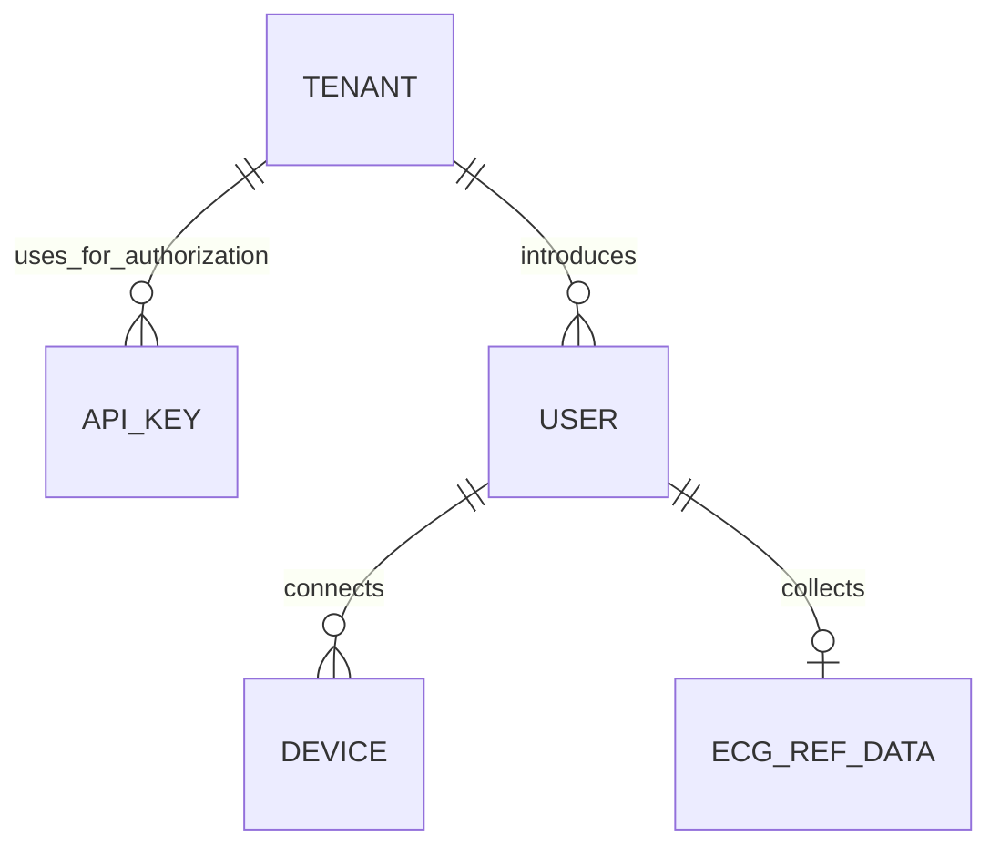

# Main Database Schema

```mermaid
erDiagram
    TENANT ||--o{ API_KEY : uses_for_authorization
    TENANT ||--o{ USER : introduces
    USER ||--o{ DEVICE : connects 
    USER ||--o| ECG_REF_DATA : collects
```
