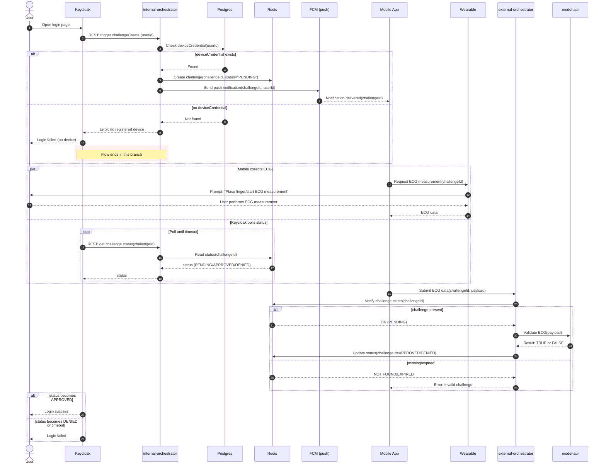

# Login Challenge Flow Overview

This section provides an overview of the login challenge flow, detailing the steps involved in authenticating users and handling various challenges that may arise during the login process.

