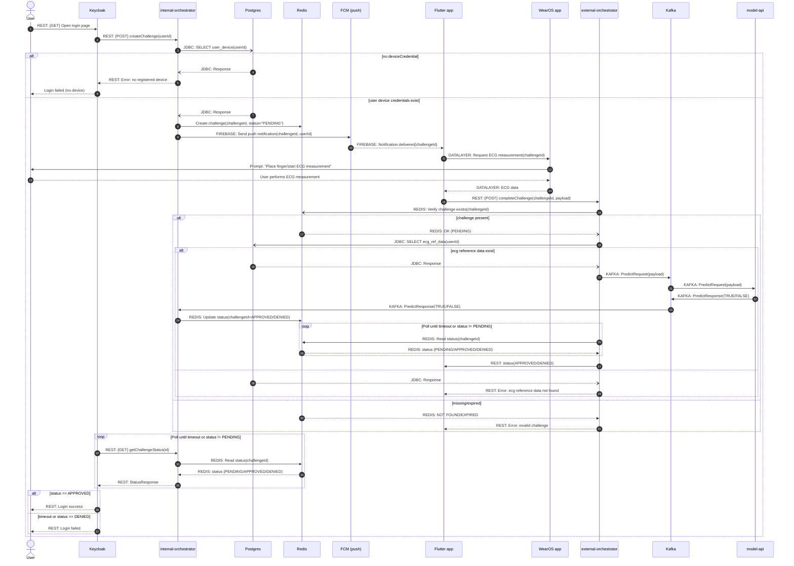

# Diagram Sekwencji dla flow logowania

* Komunikacja **REST API** z ```internal-orchestrator``` odbywa się zgodnie z [kontraktem wewnętrznym](https://github.com/KN-Emognition/orchestrator/blob/master/contract/internal.yml)
* Komunikacja **REST API** z ```external-orchestrator``` odbywa się zgodnie z [kontraktem zewnętrznym](https://github.com/KN-Emognition/orchestrator/blob/master/contract/external.yml)
* Komunikacja z ```Redis``` odbywa się zgodnie z kontraktem Redis
* Komunikacja **DataLayer API** między ```Flutter app``` oraz ```WearOS app``` odbywa się zgodnie z kontraktem DataLayer
* Komunikacja **Firebase Cloud Messaging** między ```internal-orchestrator```, ```FCM (push)``` oraz ```Flutter app``` odbywa się zgodnie z kontraktem FCM
* Komunikacja z ```Kafka``` odbywa się zgodnie z [kontraktem Kafka](https://github.com/KN-Emognition/orchestrator/blob/master/contract/model-api-kafka.yml)
* Nazwy wywoływanych operacji REST API odpowiadają **id** operacji zdefiniowanych w ww. kontraktach


